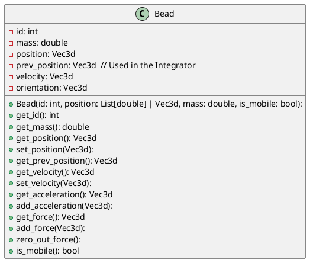
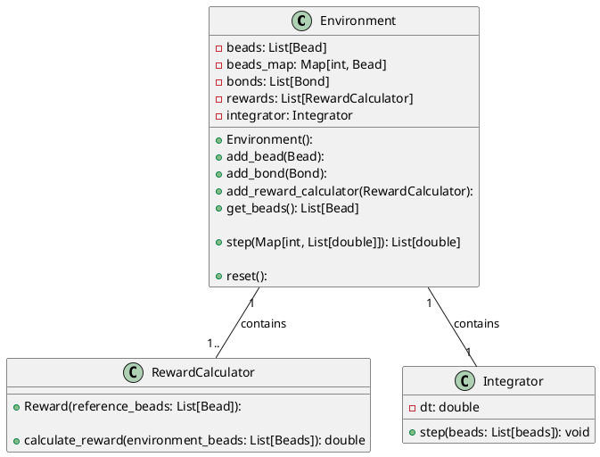
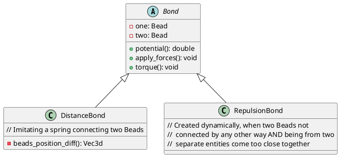

# Introduction
The Environment is built from: Beads, Bonds, Walls, Force Fields, and RewardCalculators.

A **Bead** is like an atom -- it has a position and an orientation, and can form **Bonds** with other Beads. Those Bonds can maintain a distance or a relative orientation of two Beads, as well as work as a repulsive interaction. The **Walls** are planes (for 3d) or lines (for 2d)  which cause the Beads to bounce off (if the collision is 100% elastic) or to partially dissipate their energy (not implemented yet). The **Force Field** is a volume in which either some additonal potential is being applied to the Beads and / or some random variation to the accelerations of the Beads is going to be applied (not implemented yet, but this is an important element as I'd like to be able to model turbulence).

Everything is in 3D, although during implementation I'll try to write it such that it's always possible to adapt it for a 2D application. 

The **main use-case I'm thinkin about** is an environment for a quadrotor flying along a pre-defined path ("3D race track"). The main source of inspiration was this drone from Red Bull that is capable of following an F1 car: https://youtu.be/9pEqyr_uT-k?si=XT6pCsmlhHApGAiA 
I'd like to be able to have a race of these types of drones, flying through volumes of turbulant air, to have the chassis of the drone vibrate due to falling into resonance.

A **more advanced use-case** I can foresee is a race invoving several quadrotors flying along a pre-defined path, but with obstacles / walls / etc. The quadrotors can bump against each other and the obstacles.

A **minimal use-case** is to have a 3D pendulum composed of two Beads connected by a spring Bond, in which we have control over the bottom Bead, and the objective is to hold the second Bead standing straight up above the first Bead.

Also, a **side use-case** could be a similar race to the one described above, but happening in 2D, and in this case the actuators would require implementing a vehicle dynamics model, so I'm not going to push for that too soon.

# Beads
A Beads can move in space (or not, if the `is_mobile` attribute is `false`), but some of them have also an orientation so they can "spin".

Beads can be grouped into Entities (not implemented yet) such that within it, the Beads interact only via the Bonds defined for them, but no "repulsive Bonds" will be formed even if they come very close.

# Bonds
Each Bond defines a "potential function" from which we need to extract the force / torque acting on **two** Beads. Not sure which tool to use for defining the gradients of those potentials, currently I'm manually injecting that into the classes.

# Wall
For now, I can definitely imagine:
* a floor-like Wall, i.e., one ensuring objects can take off from the floor
* sections of surfaces / lines used to define obstacles
* a tube along a list of waypoints is foreseeable. Nothing more concrete for now.

# Force Fields
I'm thinking about a high-turbulance volume in which random forces are applied to each Bead (like a Langevin Dynamics), and the strength of those turbulances might be proportional to the speed of the Bead.

# Force calculation
Once we have the updated list of Bonds, we can go through them (in parallel, perhaps), and add the resulting forces and torques to the Beads connected with those Bonds. Having done that, we can apply the forces / torques to modify the accelerations and angular accelerations. We then need to calculate updates to positions and velocitires (orientations and angular velocities) using an integration algorithm like RK4, but maybe a cool feature would be a Langevin Dynamics integrator.

# Reward
With all the above we should be in good shape to define the state and to run the simulation. But we also need to return the reward. The idea is to be able to incur cost with the Volumes and actual reward with some relation to the Beads and Bonds between them. E.g., for racing: the reward comes from progressing along the "centerline" defined by the sequence of Beads that are not part of the Environment, i.e. they don't interact with the Environment's Beads.

# UML charts
Requires `myml.vscode-markdown-plantuml-preview` and `bat67.markdown-extension-pack`.

What about the Environment?

What about the Bonds?

