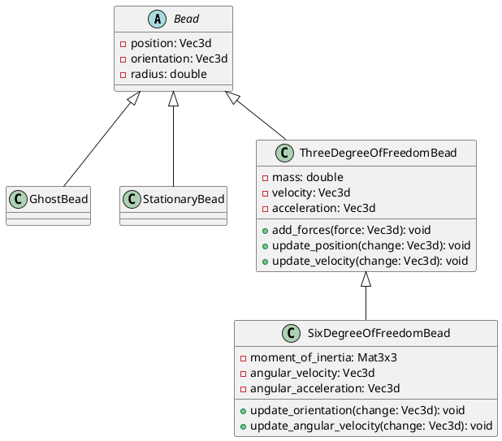
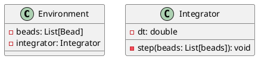
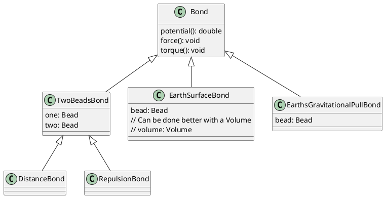

# Introduction
The Environment is built from: Beads, Bonds, and Volumes.

They are used to define the state (Beads joined with Bonds) as well as the reward (e.g., a path comprising non-material Beads connected with non-interactive Bonds).

Everything is in 3D, although during implementation I'll try to write it such that it's always possible to adapt it for a 2D application. 

The **main use-case I'm thinkin about** is an environment for a quadrotor flying along a pre-defined path ("3D race track"). Not that exciting, but actually: the main source of inspiration was this drone from Red Bull that is capable of following an F1 car: https://youtu.be/9pEqyr_uT-k?si=XT6pCsmlhHApGAiA 
I'd like to be able to have a race of these types of drones, flying through volumes of turbulant air, to have the chassis of the drone vibrate due to falling into resonance.

A **more advanced use-case** I can foresee is a race invoving several quadrotors flying along a pre-defined path, but with obstacles / walls / etc. The quadrotors can bump against each other and the obstacles.

Also, a **side use-case** could be a similar race to the one described above, but happening in 2D, and in this case the actuators would require implementing a vehicle dynamics model, so I'm not going to push for that too soon.

# Beads
There are Beads that can only move in 3D (3 Degrees of Freedom, or: 3 DoF), there are those that can't even  move, there are those that can also rotate (thus having 6 DoF), and those that are "ghost Beads" serving only as a building block for the reward function (or as a waypoint). There are also Beads that can be a source of force and torque, which makes them a kind of "actuator Beads" through which the agent will be able to change the state of the Environment.

Beads can be grouped into Entities such that within it, the Beads interact only via the Bonds defined for them, but no "repulsive Bonds" will be formed even if they come very close.

# Bonds
Some Bonds are defined when forming the Environment, some get created / deleted in the course of the Simulation. For now, I'm assuming all Bonds are composed of **two** **entities**. Meaning: I don't consider "angular bonds" made up of, say, three Beads. And about the entities: Within a Bond one element needs to be a Bead, the other one can be a Bead or: a Pose, a Position, or a Volume (floor, turbulent air, slippery surface, etc.). Bonds may define the relative length between Beads, their relative orientation, but we can also have Bonds that cause a Bead to be close to a Position, or a Pose. There are also "repulsive Bonds" that are created when two Beads from two different Entities come too close (as mentioned above) and these Bonds can be a source of force acting on the pairs of Beads being in contact, but also: a source of torque. Initially, I was thinking that the repulsion should have some asymptotic behavior, but then I realized that might cause the force to "explode". So now I'm thinking it's going to be a steep function, but with a smooth peak (maybe a very narrow Gaussian?). Same goes for the torque: I wouldn't want the torque to "explode" if the centers of the two interacting Beads are very very close to each other.

Each Bond defines a "potential function" or: a "force field" (FF) from which we need to extract the force / torque acting on the Beads. Not sure which tool to use for defining the gradients of those FFs

# Volumes
For now, I can definitely imagine:
* a floor-like Volume, i.e., one ensuring objects can take off from the floor, but I'm guessing obstacle definition could make use of this
* a high-turbulance Volume in which random forces are applied to each Bead (Langevin Dynamics)
* a tube along a list of waypoints is foreseeable. Nothing more concrete for now.

# Force calculation
Once we have the updated list of Bonds, we can go through them (in parallel, perhaps), and add the resulting forces and torques to the Beads connected with those Bonds. Having done that, we can apply the forces / torques to modify the accelerations and angular accelerations. We then need to calculate updates to positions and velocitires (orientations and angular velocities) using an integration algorithm like RK4, but maybe a cool feature would be a Langevin Dynamics integrator.

# Reward
With all the above we should be in good shape to define the State and to run the Simulation. But we also need to return the reward. The idea is to be able to incur cost with the Volumes and actual reward with some relation to the Beads and Bonds between them. E.g., for racing: the reward comes from progressing along the "centerline" defined by the sequence of "ghost Beads" and their non-interacting Bonds.

# UML charts
Requires `myml.vscode-markdown-plantuml-preview` and `bat67.markdown-extension-pack`.

What about the Environment?

What about the Bonds?

